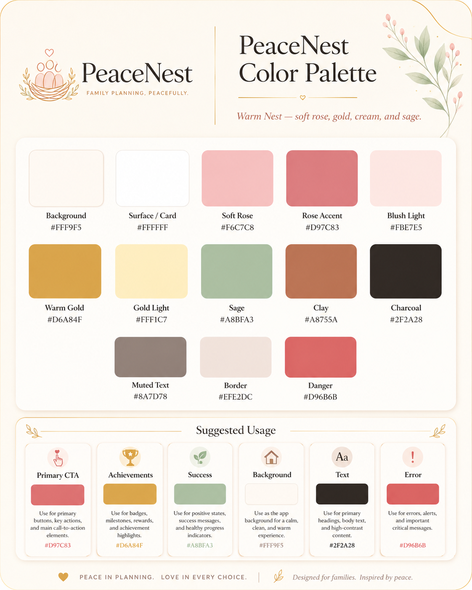

# PeaceNest Design Guide

**Design System Name:** Warm Nest UI  
**Product:** PeaceNest  
**Purpose:** Mobile-first family planning experience for Android and Web  
**Design Mood:** Calm, warm, soft, family-friendly, trustworthy, peaceful, organized, and meaningful

---

## 1. Design Concept

PeaceNest is a peaceful family planning space where families can organize their needs, wants, goals, milestones, memories, and shared priorities in one calm place.

The visual concept for PeaceNest is called **Warm Nest UI**.

Warm Nest UI should feel like a cozy digital family journal: soft rose tones, warm ivory backgrounds, gentle gold highlights, rounded cards, calm icons, and thoughtful spacing. It should not feel like a strict budgeting app or a cold productivity dashboard. Instead, it should feel like a shared family nest where plans are visible, priorities are easier to discuss, and progress feels emotionally meaningful.

The design should make users feel:

- Calm when reviewing family priorities
- Safe when discussing needs, wants, and goals
- Encouraged when seeing progress
- Included when voting or commenting
- Proud when completing milestones
- Warmly reminded, never pressured

### Design Statement

> PeaceNest is a warm family planning nest where priorities feel lighter, milestones feel meaningful, and progress feels shared.

---

## 2. Brand Personality

PeaceNest should communicate:

| Trait | UI Expression |
| --- | --- |
| Calm | Soft backgrounds, low-contrast surfaces, gentle transitions |
| Warm | Rose, ivory, clay, and gold tones |
| Trustworthy | Clear hierarchy, readable typography, consistent spacing |
| Family-friendly | Rounded shapes, friendly icons, human language |
| Meaningful | Milestone celebrations, recap moments, emotional labels |
| Organized | Cards, sections, filters, simple status badges |
| Peaceful | Minimal visual noise, soft shadows, spacious layouts |

---

## 3. Color Palette



### Primary Palette

| Token Name | Hex | Usage |
| --- | --- | --- |
| `background` | `#FFF9F5` | Main app background, onboarding background, empty state background |
| `surface` | `#FFFFFF` | Cards, sheets, modals, form containers |
| `softRose` | `#F6C7C8` | Soft brand areas, decorative accents, inactive brand elements |
| `roseAccent` | `#D97C83` | Primary buttons, active tabs, selected states, main CTA |
| `blushLight` | `#FBE7E5` | Section backgrounds, soft highlights, empty states |
| `warmGold` | `#D6A84F` | Achievements, Peace Points, milestone wins, rewards |
| `goldLight` | `#FFF1C7` | Achievement backgrounds, celebration cards, gentle badges |
| `sage` | `#A8BFA3` | Success states, completed goals, healthy progress |
| `clay` | `#B8755A` | Secondary accent, warmth, priority indicators, family notes |
| `charcoal` | `#2F2A28` | Primary text, headings, high-contrast content |
| `mutedText` | `#8A7D78` | Secondary text, captions, metadata, timestamps |
| `border` | `#EFE2DC` | Card borders, dividers, input outlines |
| `danger` | `#D96B6B` | Error states, destructive actions, important alerts |

---

## 4. Color Usage Rules

### Rose Accent

Use `roseAccent` for primary product actions.

Examples:

- Add Plan
- Create Milestone
- Invite Family
- Save Changes
- Continue
- Vote

Avoid using rose for every decorative element. It should guide action, not flood the interface.

### Warm Gold

Use `warmGold` only for special moments.

Examples:

- Milestone achieved
- Monthly recap wins
- Peace Points
- Achievement badges
- Family celebration states

Gold should feel earned. Avoid using it for normal buttons or common navigation.

### Sage

Use `sage` for progress and healthy completion.

Examples:

- Completed checklist item
- Goal on track
- Success toast
- Positive progress indicator
- Achieved status

### Ivory Background

Use `background` as the default app background. It creates warmth and gives the app a peaceful tone.

### Charcoal Text

Use `charcoal` instead of pure black. This keeps the interface readable while maintaining the soft brand mood.

---

## 5. Suggested Color Tokens

Use these as the base design tokens for frontend implementation.

```ts
export const peaceNestColors = {
  background: '#FFF9F5',
  surface: '#FFFFFF',
  softRose: '#F6C7C8',
  roseAccent: '#D97C83',
  blushLight: '#FBE7E5',
  warmGold: '#D6A84F',
  goldLight: '#FFF1C7',
  sage: '#A8BFA3',
  clay: '#B8755A',
  charcoal: '#2F2A28',
  mutedText: '#8A7D78',
  border: '#EFE2DC',
  danger: '#D96B6B',
};
```

### NativeWind / Tailwind-style Token Example

```ts
// tailwind.config.ts
export default {
  theme: {
    extend: {
      colors: {
        peacenest: {
          background: '#FFF9F5',
          surface: '#FFFFFF',
          softRose: '#F6C7C8',
          rose: '#D97C83',
          blush: '#FBE7E5',
          gold: '#D6A84F',
          goldLight: '#FFF1C7',
          sage: '#A8BFA3',
          clay: '#B8755A',
          charcoal: '#2F2A28',
          muted: '#8A7D78',
          border: '#EFE2DC',
          danger: '#D96B6B',
        },
      },
    },
  },
};
```

---

## 6. Typography Direction

### Recommended Fonts

| Role | Recommended Font | Reason |
| --- | --- | --- |
| Headings | Nunito Sans or Plus Jakarta Sans | Friendly, rounded, modern |
| Body | Inter or Nunito Sans | Clean and readable |
| Numbers / Metrics | Inter | Clear for costs, counts, and progress |

### Typography Style

| Text Type | Suggested Style |
| --- | --- |
| Screen Title | 28-32px, bold, charcoal |
| Section Title | 18-22px, semibold, charcoal |
| Card Title | 16-18px, semibold, charcoal |
| Body Text | 14-16px, regular, charcoal |
| Caption | 12-13px, regular, mutedText |
| Badge Text | 11-12px, semibold |

### Writing Tone

Use gentle and human language.

Prefer:

- `Plans for this month`
- `Family wins`
- `Still growing`
- `On track`
- `Someday`
- `Needs attention`

Avoid harsh or overly corporate words:

- `Failure`
- `Overdue penalty`
- `Critical performance issue`
- `Low productivity`

---

## 7. Layout Principles

### Overall Layout

PeaceNest should use a mobile-first layout with generous spacing and soft sections.

Recommended layout behavior:

- Use warm ivory as the main background
- Use white rounded cards for content groups
- Keep important actions close to the bottom thumb zone
- Use clear section headers
- Avoid dense tables on mobile
- Use cards, chips, filters, and progress bars

### Spacing Scale

| Token | Value | Usage |
| --- | --- | --- |
| `space-xs` | 4px | Small icon gaps |
| `space-sm` | 8px | Badge spacing, compact gaps |
| `space-md` | 12px | Card internal spacing |
| `space-lg` | 16px | Default screen spacing |
| `space-xl` | 24px | Section spacing |
| `space-2xl` | 32px | Page-level spacing |

### Radius Scale

| Token | Value | Usage |
| --- | --- | --- |
| `radius-sm` | 10px | Badges, chips |
| `radius-md` | 14px | Inputs |
| `radius-lg` | 18px | Buttons |
| `radius-xl` | 24px | Cards |
| `radius-2xl` | 28px | Hero cards, modals, bottom sheets |

---

## 8. Component Styling Guide

### Buttons

#### Primary Button

Use for the main action on a screen.

```txt
Background: roseAccent #D97C83
Text: white #FFFFFF
Radius: 18px
Height: 48-56px
Font: semibold
```

Examples:

- Create Plan
- Add Milestone
- Invite Family
- Save

#### Secondary Button

Use for supporting actions.

```txt
Background: blushLight #FBE7E5 or surface #FFFFFF
Text: roseAccent #D97C83
Border: border #EFE2DC
Radius: 18px
```

#### Celebration Button

Use rarely for milestone or recap experiences.

```txt
Background: warmGold #D6A84F
Text: charcoal #2F2A28 or white #FFFFFF depending on contrast
```

---

### Cards

Cards are the main UI container for PeaceNest.

```txt
Background: surface #FFFFFF
Border: border #EFE2DC
Radius: 24px
Shadow: soft and warm
Padding: 16-20px
```

Card types:

- Priority plan card
- Milestone card
- Recap card
- Family member card
- Activity card
- Notification card

Cards should feel layered but not heavy.

---

### Badges

Badges should make information quick to scan.

| Badge | Background | Text |
| --- | --- | --- |
| Need | `goldLight` | `clay` |
| Want | `blushLight` | `roseAccent` |
| Milestone | `goldLight` | `warmGold` |
| Completed | soft sage tint | `sage` or charcoal |
| Now | `roseAccent` | white |
| Soon | `goldLight` | `clay` |
| Someday | `blushLight` | `mutedText` |

Recommended priority language:

```txt
Now
Soon
Someday
```

This feels warmer and more family-friendly than `High`, `Medium`, and `Low`.

---

### Inputs

```txt
Background: surface #FFFFFF
Border: border #EFE2DC
Focused Border: roseAccent #D97C83
Text: charcoal #2F2A28
Placeholder: mutedText #8A7D78
Radius: 14-18px
```

Input fields should feel gentle and readable, not clinical.

---

### Progress Bars

Use progress bars for goals, milestones, savings, and checklists.

```txt
Track: blushLight #FBE7E5 or border #EFE2DC
Progress: sage #A8BFA3
Achievement highlight: warmGold #D6A84F
```

Use sage for normal progress. Use gold only when something is completed or celebrated.

---

### Icons

Recommended icon style:

```txt
Icon Set: Lucide React Native
Stroke: 1.75px to 2px
Shape: rounded, simple, calm
```

Suggested icons:

- Home
- Heart
- Users
- Calendar
- CheckCircle
- MessageCircle
- Bell
- Trophy
- Sparkles
- Leaf
- ClipboardList
- Gift

Avoid overly financial icon-heavy visuals unless the feature requires it.

---

## 9. Screen Direction

### Home Dashboard

The Home Dashboard should feel like the family’s planning table.

Recommended sections:

- Warm welcome card
- Family overview
- Top priorities
- Upcoming milestone
- Recent activity
- Monthly recap preview
- Notification summary

Visual notes:

- Use a soft rose or blush header
- Use white cards on ivory background
- Highlight important wins with gold
- Keep dashboard content scannable

---

### Wants & Needs

This screen should focus on clarity and shared decision-making.

Recommended filters:

```txt
All | Needs | Wants | Completed
```

Each item card should show:

- Title
- Need / Want badge
- Estimated cost, if available
- Priority status
- Family votes
- Progress
- Comment count

Priority labels:

```txt
Now
Soon
Someday
```

---

### Family Milestones

This screen should feel more emotional and memory-focused.

Milestone examples:

- Sunday Family Dinner
- Child Graduation
- Visit Grandparents Monthly
- Less Screen Time Challenge
- Family Reunion

Each milestone card should show:

- Milestone title
- Target date
- Participants
- Checklist progress
- Status badge
- Optional memory/photo attachment indicator

Use gold for achieved milestones and sage for progress.

---

### Recaps

Recaps should feel like a family reflection letter, not an analytics report.

Recommended sections:

- Peace Wins
- Plans Completed
- Family Moments
- Still Growing
- Next Month’s Gentle Focus

Visual notes:

- Use gold for wins
- Use blush for soft reflection cards
- Use sage for completed progress
- Keep charts minimal and friendly

---

### Notifications

Notifications should feel gentle and helpful.

Examples:

- `Lara voted on Family Vacation`
- `Tuition plan moved to Now`
- `Monthly recap is ready`
- `Grandparents visit milestone is almost complete`

Avoid alarm-heavy visual treatment unless the notification is truly urgent.

---

## 10. Empty States

Empty states should encourage action without guilt.

### Example: No Wants & Needs Yet

```txt
Title: Start with one family plan
Message: Add a need, a want, or something your family wants to talk about together.
CTA: Add First Plan
```

### Example: No Milestones Yet

```txt
Title: Create your first family milestone
Message: Milestones can be big or small, from graduation goals to Sunday dinners.
CTA: Add Milestone
```

### Example: No Recap Yet

```txt
Title: Your first recap is growing
Message: Complete plans, add milestones, and PeaceNest will help summarize your family’s progress.
CTA: View Plans
```

Use small warm illustrations or mascot moments here.

---

## 11. Illustration and Mascot Direction

PeaceNest can use a small, gentle mascot or illustration system.

Recommended mascot direction:

```txt
Character: tiny dove, sparrow, or nest guide
Style: soft 3D plush or warm flat illustration
Personality: calm, encouraging, helpful
Usage: onboarding, empty states, milestone celebrations, recaps
```

Possible mascot name:

```txt
Pip
```

Mascot rules:

- Keep it gentle and supportive
- Do not make it too playful during serious planning moments
- Use it more in empty states and celebrations than in dense workflow screens

---

## 12. Motion and Interaction

Motion should feel soft and reassuring.

Recommended motion:

- Gentle card fade-ins
- Soft scale on button press
- Smooth progress bar fill
- Tiny sparkle or confetti on milestone completion
- Subtle bottom sheet slide-up

Avoid:

- Harsh bouncing
- Loud confetti on every action
- Fast flashing animations
- Overly playful transitions during planning or money-related flows

---

## 13. Accessibility Notes

PeaceNest uses a soft palette, so contrast must be checked carefully.

Rules:

- Use `charcoal` for body text on light backgrounds
- Avoid using `softRose` as text on white
- Use `roseAccent` mainly for buttons and icons, not long text
- Ensure badges have readable text contrast
- Use more than color to communicate status: icons, labels, and text should also explain state
- Error states should include text labels, not only red color

---

## 14. Example UI Token File

```ts
export const peaceNestTheme = {
  colors: {
    background: '#FFF9F5',
    surface: '#FFFFFF',
    softRose: '#F6C7C8',
    roseAccent: '#D97C83',
    blushLight: '#FBE7E5',
    warmGold: '#D6A84F',
    goldLight: '#FFF1C7',
    sage: '#A8BFA3',
    clay: '#B8755A',
    charcoal: '#2F2A28',
    mutedText: '#8A7D78',
    border: '#EFE2DC',
    danger: '#D96B6B',
  },
  radius: {
    sm: 10,
    md: 14,
    lg: 18,
    xl: 24,
    '2xl': 28,
  },
  spacing: {
    xs: 4,
    sm: 8,
    md: 12,
    lg: 16,
    xl: 24,
    '2xl': 32,
  },
};
```

---

## 15. Frontend Implementation Notes

PeaceNest should stay consistent with the frontend technical direction:

- React Native
- Expo
- Expo Router
- TypeScript
- NativeWind
- React Native Reusables
- Lucide React Native

Design implementation rules:

- Create design tokens early
- Use tokens instead of hardcoded colors
- Keep components reusable
- Keep screen layouts mobile-first
- Avoid mixing too many UI libraries
- Use Lucide React Native as the default icon system
- Use Expo Vector Icons only as fallback

---

## 16. Final Design Direction

PeaceNest should not look like a finance app wearing pink paint. It should look like a warm family planning system built around clarity, shared direction, and emotional safety.

The final UI should feel:

```txt
Soft but usable
Warm but not childish
Elegant but not luxury
Organized but not rigid
Encouraging but not noisy
Family-centered but still modern
```

### Final Design Line

> PeaceNest is a calm digital nest for family planning, where needs, wants, milestones, and memories come together with warmth, clarity, and peace.
